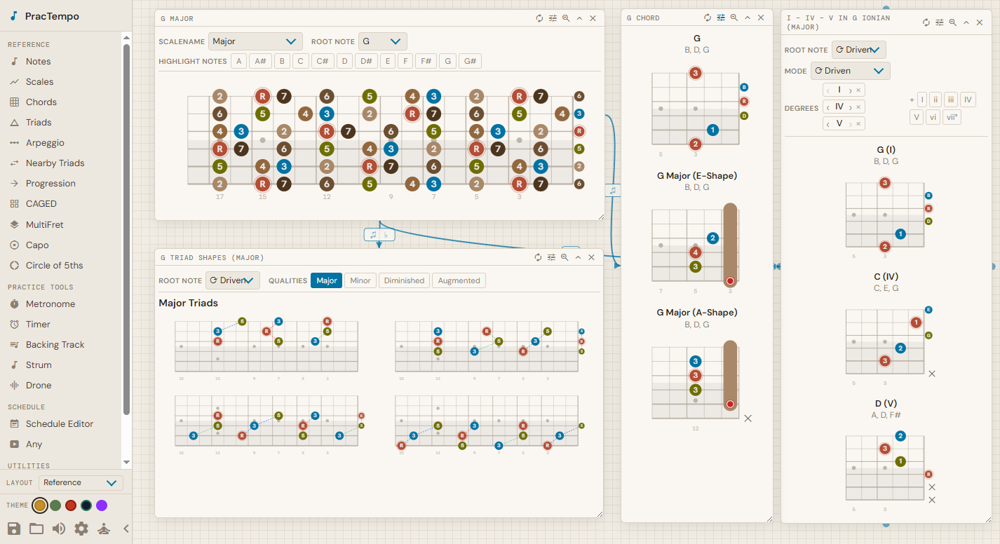
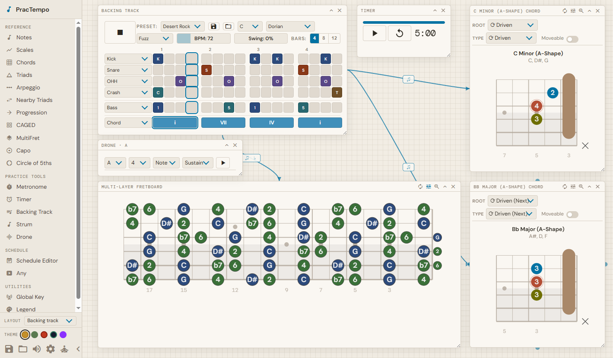

# FretFalcon

**A practice timer that shows you what to play.**

Sick of flipping between generic scale diagrams, messy chord charts, and external metronomes? *FretFalcon* is a free web app that puts every theory reference and practice tool exactly where you need it. Built for absolutely anyone on a fretted instrument (including left-handed players, players of custom tunings, and niche instruments like the charango and mandola), it lets you drag, drop, and link interactive fretboards, chord diagrams, triad hints, backing tracks, metronomes, chord progressions, and more. All your essential tools are visible in a single easy-to-read page, so your hands stay on the strings instead of your mouse. As a bonus, you can build timed practice intervals to automatically switch your references as you progress through your session. Desktop recommended, mobile supported.

[](https://html-preview.github.io/?url=https://github.com/RWLPedal/FretFalcon/blob/main/dist/index.html)



---

## Who is this for?

<table>
<tr>
<td valign="top" width="50%">

**Fretted musicians with a practice routine**

Stop noodling and start progressing. Build a custom schedule for your practice session, that keeps track of time and displays appropriate references and practice aids as you progress through the lesson. No more flipping through tabs or fumbling with different pages.

</td>
<td valign="top" width="50%">

**Theory learners**

Sick of searching for decent image references of scales, chords, shape references, etc - all with their own semantics, poorly sized, or filled with ads? Look no further. Browse 30+ scales with chord tones, chord diagrams, triads, CAGED shapes, and the Circle of Fifths. Bring up any combination as floating panels side-by-side, so you can cross-reference while you play.

</td>
</tr>
<tr>
<td valign="top" width="50%">

**Left-handed players**

Built by a lefty. First-class left-handed support throughout: chord diagrams and fretboards work equally well in left-handed and right-handed modes. Clear indications of low and high strings leave nothing ambiguous. No more rotating shapes in your head.

</td>
<td valign="top" width="50%">

**Players of underrepresented instruments**

Guitars (6-, 7-, 8-string, tenor), basses, ukuleles, mandolins, mandolas, charangos, bouzoukis and mandolas are all supported with instrument-appropriate diagrams. Supports custom tuning.

</td>
</tr>
</table>

---

## Key Features

        




### Structured Practice Sessions

Build a full practice schedule with named timed intervals. The schedule editor supports drag-and-drop reordering, clipboard copy/paste, saving and loading schedules, and keyboard shortcuts. FretFalcon notifies you when each interval ends, and advances automatically.

### Fretboard & Theory Reference

- **Fretboard diagrams** - Visualize scales and chord tones on an interactive neck. Overlay multiple layers on the same fretboard to visualize voice leading.
- **Scale library** - 30+ types including major, minor, pentatonic, blues, and all seven modes.
- **Chord diagrams** - Open and closed chords with configurable root and voicing.
- **Chord progressions** - Easily visualize a full sequence of chords in your chosen key.
- **Triads** - Major, minor, diminished and augmented triad shapes across the neck. Triad wizard to find clean triad progressions for voice leading on the same fretboard.
- **CAGED system** - All five CAGED-position shapes, color-coded by position.
- **Circle of Fifths** - Interactive diagram with diatonic chord highlighting and relative minor ring.
- **Capo calculator** - Translate open chord shapes to any capo position.

### Audio Tools

- **Metronome** - Visual and audio, available as a floating panel at any time.
- **Backing track** - Fully synthesized backing tracks. Includes drum machine with configurable patterns, bass line, built-in chord progressions, and swing control. 10+ preset patterns, 7 drum sounds, and 7 custom voices.
- **Drone** - Continuous pitch generator for tuning and ear training.
- **Strum patterns** - Customize your strumming pattern, with presets.

### Linked Panels

Panels don't exist in isolation. Hook up panels to make configuration easy. A backing track can drive visualization changes for chord diagrams or chord tones over a scale. The Circle of Fifths can change your backing track. Use your custom strum pattern to control chords in the backing track. Build the signal flow that fits how you think.

### Customizable Workspace

* **Everything is a panel** - Every tool is a draggable, resizable floating panel. Arrange them however you like - layouts save automatically, or you can download the one you created. Or, use a predefined layout for common tasks.
* **Tidy up** - Position panels freely, or neatly align with snap-to-grid positioning. 
*  **Themes** - Supports five distinct visual themes: warm bauhaus, mossy nature journal, faded tape deck, glassy modern, and synthwave.
*  **Multi-platform** - Works on desktop or mobile (some features limited).
*  **Zen** - Hide superfluous UI elements with zen mode.

---

## Technical Philosophy

* FretFalcon is built to be a single downloadable, transportable html file.
* It has an intentionally simple dependency stack: no UI framework, no predefined CSS libraries. The stack is TypeScript, Webpack, and vanilla DOM - no React, no Vue, no runtime dependencies beyond what the browser already provides. This keeps the built output a single self-contained HTML file that can be opened locally, hosted on a static server, or previewed directly from GitHub without a build step.
* Each panel is a self-registering module. Adding a new tool means implementing a small interface and registering it; the workspace, panel linking system, and layout persistence handle the rest automatically. The goal is a codebase where any panel can be understood in isolation, and where the overall architecture stays legible as the feature set grows.

## Getting Started

No installation required - [try the live demo](https://html-preview.github.io/?url=https://github.com/RWLPedal/FretFalcon/blob/main/dist/index.html) directly in your browser.

Worried the link might go down? You can simply download the `dist/index.html` to your hard drive, and open it in your browser.

If you'd like to host or do local development:

```bash
cd ts
npm install
npm run start   # serves at localhost:4000
```

To build the single deployable file (`dist/index.html`):

```bash
node build_html
```

**Build dependencies:** Node.js and npm. 

## Learn more

See [GUIDE.md](GUIDE.md) for a full feature walkthrough. See [TODO.md](TODO.md) for planned features.